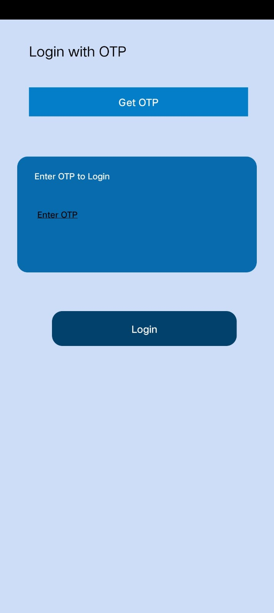
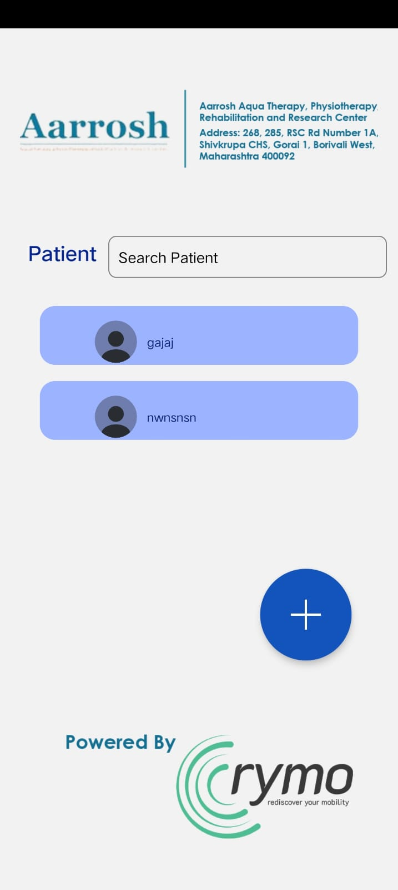
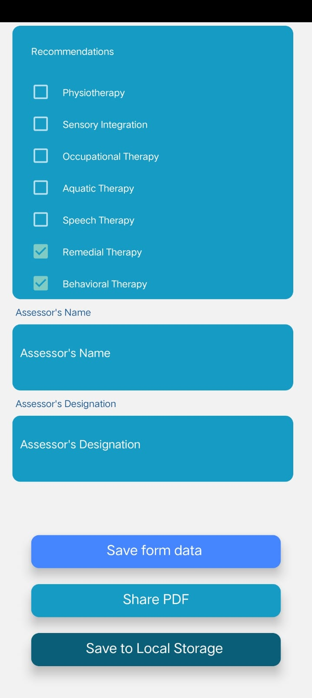

# Assessment App 
 
Features  
- Login with OTP  
- Different Forms  
- User can Save Form to DB so that even if they close and reopen the app the Data is present  
- User can Share the Form through different platforms  
- User can Save the form to local Storage  
 
Screenshots  
 

  
  
  

 
Tech Stack-  
-React Native (frontend)  
-Redux (State management)  
-Sqlite (Database) 
-Springboot(Backend) 
-CloudService(AWS EC2) -For Hosting Backend  
